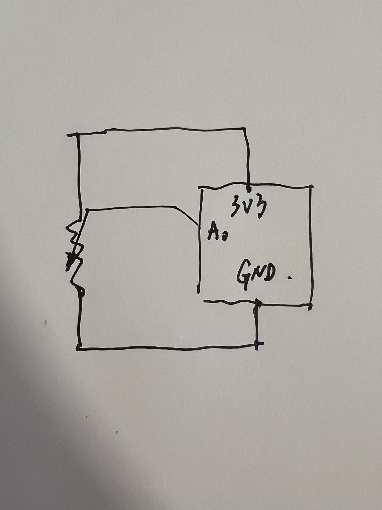

# HW13

Arduino reads potentiometer which act as the slider to change the threshold for color-changing of the painting.

Sketch
 

https://drive.google.com/file/d/1g4u6Kl85LFRi0BNeSH3DF5jfPJNmlN4j/view?usp=sharing
